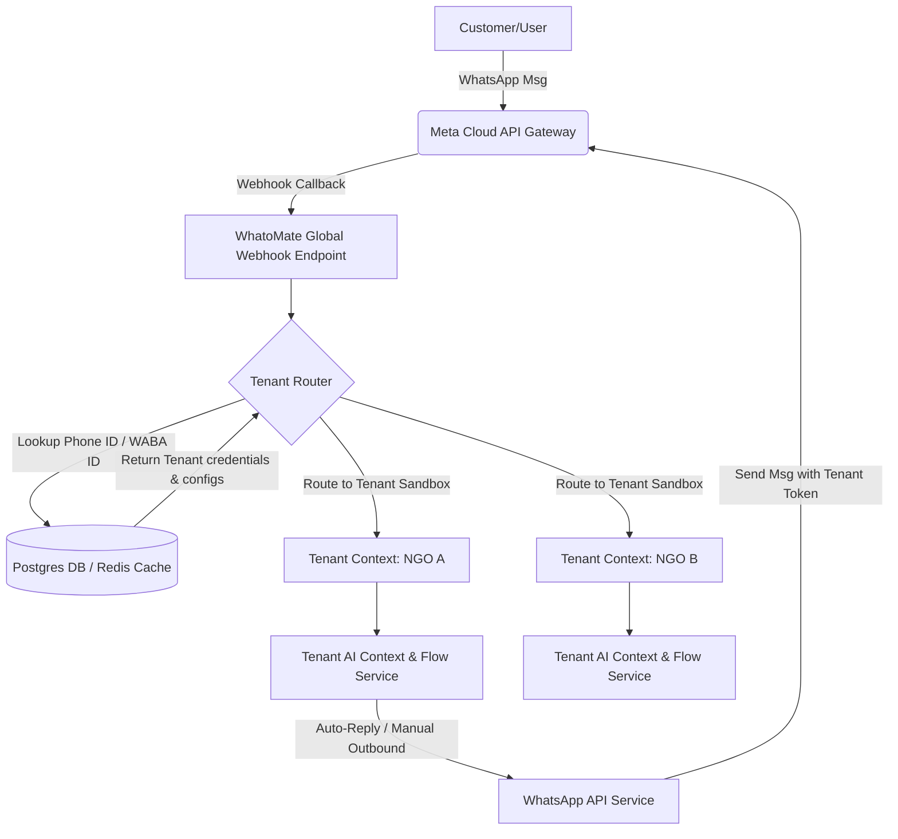
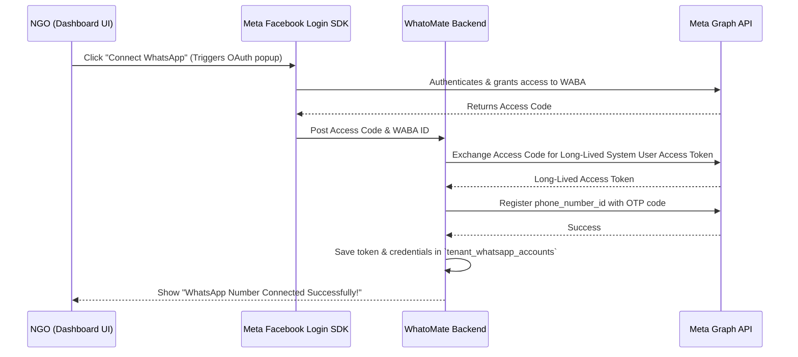

# Transitioning WhatoMate to a Multi-Tenant SaaS Platform (BSP Model)

This guide provides a detailed overview of the architectural changes, database schema migrations, and code modifications required to transform **WhatoMate** into a multi-tenant SaaS platform where your organization hosts the Meta WhatsApp infrastructure, and NGOs can sign up and connect their numbers instantly.

---

## 1. Architectural Overview

In a single-tenant model, WhatoMate relies on static `.env` settings (`WHATSAPP_PHONE_ID`, `WHATSAPP_TOKEN`) and syncs messages to a single default dashboard.

In the **SaaS / BSP Model**:
1. **Your App & Webhook** are registered as a **Meta Tech Provider**.
2. **NGOs** use Meta's **Embedded Signup (OAuth)** to connect their WhatsApp numbers to your Meta App.
3. The **Middleware** receives all incoming webhooks on a single global endpoint (`/webhook`).
4. The **Webhook Controller** dynamically looks up the `phone_number_id` or `WABA_ID` from the incoming payload in a database/cache to identify the **Tenant (NGO)** and their respective **Meta access credentials**.

### System Architecture Flow



---

## 2. Phase 1: Database Schema Migration (Postgres)

We must migrate from a single-tenant layout to a multi-tenant layout. All core models (Contacts, Messages, AI Contexts, Users) must be scoped to an **Organization** or a specific **WhatsApp Account**.

### Recommended Postgres Schema Additions

```sql
-- 1. Organizations Table
CREATE TABLE organizations (
    id UUID PRIMARY KEY DEFAULT gen_random_uuid(),
    name VARCHAR(255) NOT NULL,
    slug VARCHAR(255) UNIQUE NOT NULL,
    status VARCHAR(50) DEFAULT 'active', -- active, suspended, billing_failed
    created_at TIMESTAMP WITH TIME ZONE DEFAULT CURRENT_TIMESTAMP,
    updated_at TIMESTAMP WITH TIME ZONE DEFAULT CURRENT_TIMESTAMP
);

-- 2. Meta WhatsApp Accounts (One organization can have multiple phone numbers)
CREATE TABLE tenant_whatsapp_accounts (
    id UUID PRIMARY KEY DEFAULT gen_random_uuid(),
    organization_id UUID NOT NULL REFERENCES organizations(id) ON DELETE CASCADE,
    waba_id VARCHAR(100) NOT NULL UNIQUE,          -- Meta WABA ID
    phone_number_id VARCHAR(100) NOT NULL UNIQUE,  -- Meta Phone Number ID
    display_phone_number VARCHAR(50) NOT NULL,      -- e.g. +16505551111
    access_token TEXT NOT NULL,                     -- Delegated System User Token
    status VARCHAR(50) DEFAULT 'pending',          -- pending, active, disconnected
    quality_rating VARCHAR(50) DEFAULT 'GREEN',    -- GREEN (High), YELLOW (Medium), RED (Low)
    messaging_limit_tier VARCHAR(50) DEFAULT 'TIER_1K', -- 1K, 10K, 100K, Unlimited
    created_at TIMESTAMP WITH TIME ZONE DEFAULT CURRENT_TIMESTAMP,
    updated_at TIMESTAMP WITH TIME ZONE DEFAULT CURRENT_TIMESTAMP
);

-- 3. Scope Contacts and Messages to the Specific WhatsApp Account
ALTER TABLE contacts ADD COLUMN whatsapp_account_id UUID REFERENCES tenant_whatsapp_accounts(id) ON DELETE SET NULL;
ALTER TABLE contacts ADD COLUMN organization_id UUID REFERENCES organizations(id) ON DELETE CASCADE;

ALTER TABLE messages ADD COLUMN whatsapp_account_id UUID REFERENCES tenant_whatsapp_accounts(id) ON DELETE CASCADE;
```

---

## 3. Phase 2: Meta Embedded Signup Integration

The Embedded Signup flow enables NGOs to grant your Meta App permissions to manage their WhatsApp numbers.



### Implementing Frontend Facebook Login SDK
Add the Meta Business Login button to the WhatoMate settings page:

```javascript
// Load the Facebook SDK
window.fbAsyncInit = function() {
  FB.init({
    appId      : 'YOUR_META_APP_ID',
    cookie     : true,
    xfbml      : true,
    version    : 'v18.0'
  });
};

function launchWhatsAppSignup() {
  FB.login(function(response) {
    if (response.authResponse) {
      const accessToken = response.authResponse.accessToken;
      // Send token to backend to retrieve the shared accounts
      fetch('/api/whatsapp/embedded-signup', {
        method: 'POST',
        headers: { 'Content-Type': 'application/json' },
        body: JSON.stringify({ accessToken })
      }).then(res => res.json()).then(data => {
        alert('Verification success! Select the phone number you want to activate.');
      });
    } else {
      console.log('User cancelled login or did not fully authorize.');
    }
  }, {
    scope: 'whatsapp_business_management,whatsapp_business_messaging',
    extras: {
      feature: 'whatsapp_embedded_signup',
      setup: {
        // Options for setting up WABA/Phone number
      }
    }
  });
}
```

---

## 4. Phase 3: Webhook Routing Refactor

Currently, your [webhookController.js](file:///home/praveen/whatomate/WhatoMate/src/controllers/webhookController.js) parses callbacks globally using fixed `.env` tokens. 

We need to rewrite this to support dynamic tenant routing.

### Refactored Webhook Parsing (`src/controllers/webhookController.js`)

```javascript
const tenantCache = require('../services/tenantCache'); // In-memory/Redis Cache
const flowService = require('../services/flowService');
const crmService = require('../services/crmService');
const whatomateService = require('../services/whatomateService');

exports.processMessage = async (req, res) => {
    // Acknowledge immediately so Meta doesn't retry
    res.status(200).send('OK');

    try {
        const body = req.body;
        if (body.object !== 'whatsapp_business_account') return;

        const entry = body.entry?.[0];
        const changes = entry?.changes?.[0];
        const value = changes?.value;

        // Route status updates (delivered, read, quality score changes)
        if (value?.statuses?.length) {
            await handleStatusUpdate(value.statuses[0]);
            return;
        }

        const message = value?.messages?.[0];
        const contact = value?.contacts?.[0];
        if (!message) return;

        // ── 💥 CRITICAL: DYNAMIC TENANT IDENTIFICATION ──
        const phoneId = value?.metadata?.phone_number_id;
        const wabaId = entry?.id; // The Meta WhatsApp Business Account ID

        // Retrieve Tenant Credentials dynamically
        const tenant = await tenantCache.getTenantByPhoneId(phoneId);
        if (!tenant) {
            console.error(`[Webhook] ❌ Unregistered phone_number_id: ${phoneId}`);
            return;
        }

        const fromPhone   = message.from;
        const contactName = contact?.profile?.name || 'User';

        let textContent = '';
        if (message.type === 'text') {
            textContent = message.text?.body || '';
        } else if (message.type === 'interactive') {
            textContent = message.interactive?.button_reply?.title || message.interactive?.list_reply?.title || '';
        } else {
            textContent = `[Received ${message.type} message]`;
        }

        // 1. Multi-tenant Database Sync
        let user = await crmService.getTenantUser(tenant.organization_id, fromPhone);
        if (!user) {
            await crmService.createTenantUser(tenant.organization_id, fromPhone, contactName);
            user = await crmService.getTenantUser(tenant.organization_id, fromPhone);
        }

        // 2. WhatoMate Sync (Send along tenant credentials so CRM links correct inbox)
        const whatomateContactId = await whatomateService.syncIncomingTenant(
            tenant.organization_id,
            fromPhone,
            contactName,
            textContent,
            body
        );

        // 3. Process chatbot flow using Tenant Config (passing active credentials)
        await flowService.handleIncomingMessage(
            fromPhone,
            message,
            user,
            whatomateContactId,
            tenant // contains specific token, phoneId, and custom prompts
        );

    } catch (error) {
        console.error('❌ Error processing webhook:', error);
    }
};
```

### Refactored Outbound Service (`src/services/whatsappService.js`)
Instead of a singleton using environment tokens, the send function accepts the `tenant` credential object:

```javascript
const axios = require('axios');

class WhatsAppService {
    async sendTextMessage(tenant, to, text) {
        const baseUrl = `https://graph.facebook.com/v18.0/${tenant.phone_number_id}/messages`;
        try {
            await axios.post(
                baseUrl,
                {
                    messaging_product: 'whatsapp',
                    recipient_type: 'individual',
                    to: to,
                    type: 'text',
                    text: { preview_url: false, body: text }
                },
                {
                    headers: {
                        Authorization: `Bearer ${tenant.access_token}`,
                        'Content-Type': 'application/json'
                    }
                }
            );
            console.log(`✅ Message sent to ${to} for Tenant: ${tenant.organization_id}`);
        } catch (error) {
            console.error(`❌ Failed to send message to ${to}:`, error.response?.data || error.message);
        }
    }
}
```

---

## 5. Phase 4: Shared WABA Management, Throttling & Quality Control

### A. Number Quality Rating Throttling
If one NGO sends spam, it affects the shared WABA limit or flags your Tech Provider app. You must isolate this:
- Meta sends status updates in the webhook when a number's quality rating drops:
```json
{
  "field": "phone_number_quality_update",
  "value": {
    "display_phone_number": "16505551111",
    "event": "QUALITY_RATING_DOWNGRADED",
    "current_rating": "RED"
  }
}
```
- **Implementation**: Write a webhook parser for `phone_number_quality_update`. When a phone number hits `RED` (Low Quality) or `Flagged`, notify the organization via the dashboard, and restrict bulk message templates (Campaigns) for that account to protect your WABA reputation.

### B. Shared Messaging Limit Throttling (Redis Token Bucket)
Meta enforces strict daily limits based on tiers (1K, 10K, 100K messages).
Implement an internal rate limiter in the Campaign router:
- Store the count of conversations/messages dispatched per organization in Redis.
- If a tenant reaches 80% of their allocated daily limit, fire an alert.
- Block sending when the limit is breached to save quota for other tenants.

---

## 6. Phase 5: Template Management at Scale

NGOs must create and manage templates. You can wrap the Meta Graph API in your dashboard.

### 1. Submitting Templates
When a user drafts a template in your UI:
```javascript
// Submit to Meta
async function submitTemplateToMeta(tenant, templateData) {
    const url = `https://graph.facebook.com/v18.0/${tenant.waba_id}/message_templates`;
    const response = await axios.post(url, {
        name: templateData.name.toLowerCase().replace(/ /g, '_'),
        category: templateData.category,
        language: templateData.language || 'en_US',
        components: templateData.components
    }, {
        headers: { Authorization: `Bearer ${tenant.access_token}` }
    });
    return response.data; // returns template ID and approval status
}
```

### 2. Auto-Syncing Template Approval Status
Meta fires a webhook event when templates are approved or rejected.
- Subscribe your global webhook to `message_template_status_update`.
- Update your database `status` fields automatically when the webhook is received, giving NGOs instant visual status updates inside WhatoMate.

---

## 7. Next Steps Checklist for Implementation

- [ ] **Create a Meta App** in Business Suite and select the **Tech Provider** configuration.
- [ ] **Migrate Database Schema** to PostgreSQL to support multi-tenancy.
- [ ] **Build Embedded Signup Flow Route** on frontend settings and Backend authentication callback.
- [ ] **Implement Dynamic Webhook Routing Middleware** in Express by matching incoming payloads to DB credentials.
- [ ] **Build the Template Management Dashboard UI** integrating Meta's Template API.
- [ ] **Deploy Throttling & Quality Monitoring Systems** via Redis.
